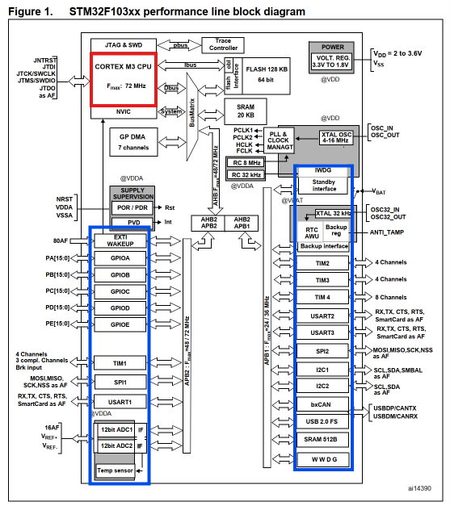
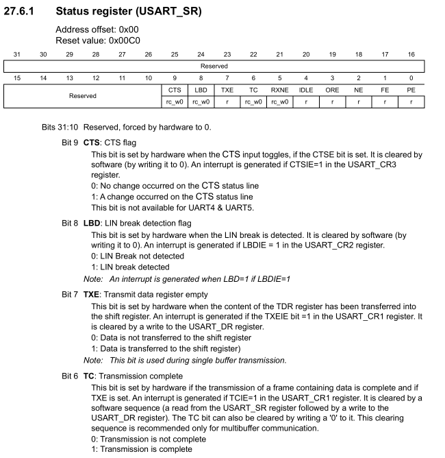

# 单片机结构

电控，又称嵌入式软件，顾名思义就是臭敲代码的。那么代码究竟是如何在单片机上跑的呢？从这一章开始，我们将逐步理解我们的代码在单片机上干了什么。

C/C++ 源码不能直接被 MCU 执行。编译器要把源代码转换成目标 CPU 能理解的机器指令。这个过程至少依赖两类目标信息。

- 指令集
- ABI

本章，我们将初步了解指令集与 ABI 的区别，理解其在编译过程中的作用。

## 本章要点

- 指令集架构
- ABI
- 核心结构与 MCU 结构

## 指令集架构

指令集架构（Instruction Set Architecture）是计算机抽象模型的一部分，定义了CPU如何被软件控制，是硬件与软件之间的接口。它规定了处理器能做什么以及如何做，是程序员可见的机器部分。
指令集决定了计算机能够实现什么功能，如何将代码编译为机器码进而实现具体功能。因此不同架构的指令集编译出的机器码也不同。

简单来说，指令集是代码到机器码的桥梁。

下方列举了一些在 MCU 中常见的指令集类型。

| 架构名称         | 指令集类型 | 常见位数 | 代表厂商/系列                                                           | 核心特点                                                   | 典型应用场景                           |
| ---------------- | ---------- | -------- | ----------------------------------------------------------------------- | ---------------------------------------------------------- | -------------------------------------- |
| **ARM Cortex-M** | RISC       | 32位     | STM32（ST）、GD32（兆易创新）、Kinetis（NXP）、LPC（NXP）、MSP432（TI） | 生态完善、性能均衡、超低功耗                               | 消费电子、工业控制、汽车电子           |
| **RISC-V**       | RISC       | 32/64位  | GD32V（兆易创新）、SiFive FE310、Kendryte K210                          | 开源免费、模块化设计、可自定义扩展指令                     | 学术研究、定制化、成本敏感场景         |
| **8051**         | CISC       | 8位      | STC89系列、Silicon Labs EFM8                                            | 历史悠久、成本极低、开发简单、指令丰富但速度受限，功耗较高 | 教学入门、简单工业控制、低成本消费电子 |
| **AVR**          | RISC       | 8位      | Microchip ATmega系列（Arduino Uno）                                     | 哈佛架构，指令线与数据线分离，单周期指令执行，速度优于8051 | 创客教育、传感器节点、简单项目         |
| **MSP430**       | RISC       | 16位     | Texas Instruments MSP430系列                                            | 超低功耗                                                   | 便携式医疗、无线传感器、仪表测量       |
| **PowerPC**      | RISC       | 32位     | NXP（原Freescale）                                                      | 高性能、高可靠性，支持多核                                 | 汽车电子、航空航天、网络通信           |
| **x86**          | CISC       | 32/64位  | Intel Atom、AMD嵌入式G系列                                              | 高性能，兼容PC软件生态，功耗较高                           | 工业PC、医疗设备、数字标牌             |
| **DSP**          | 专用       | 16/32位  | TI C2000/C6000、ADI SHARC                                               | 专为数字信号处理优化，擅长高速运算                         | 音频处理、电机控制、通信基站           |

需要注意的是，上图所说的指令集是一个宏观上的指令集，往下还可以细分具体架构版本、具体指令集等细节，比如：

基于 ARM Cortex-M7 内核的 STMH723VG 就支持 thumb2 基础指令集，同时支持 DSP、FPU 等扩展指令集。

## ABI

解决完编译的问题，接下来就是链接了。

C/C++ 的最小编译单元是文件，那么从文件到文件，函数到函数，我们就需要规定:

- 函数调用时参数怎么传，放在哪里
- 函数的名字如何用二进制表示
- 诸多细节问题

ABI 就为我们提供了一套标准。不同的 ABI 规定了诸多链接时的标准。
但需要注意的是：ABI 大部分时间作用于链接期，但也会影响编译期行为；同理，指令集大部分时间作用于编译期，但也会影响链接期行为。

## 内核

> 在此指的内核（core）是硬件上的结构，和软件上的内核（kernal）不同。

内核是执行程序的部分。它从存储器取出指令，译码并执行，维护寄存器、程序计数器和异常状态。对软件来说，内核像是“会运行指令的机器”。

简单来说，你的代码由内核执行。

## 外设

> 本部分可配合 [野火单片机教程](https://www.bilibili.com/video/BV1Vt411X7PK/?p=4&share_source=copy_web&vd_source=de770ffc23fc2651b6ae5b4b0694e6a0)，需要注意视频中部分术语与概念存在错误，如果觉得有问题可以借助 AI 大胆质疑

MCU 光有计算功能可不行，我们想要的并不是一个计算器，而是一个可以与外界世界交互的平台。因此，外设（peripheral）便诞生了。

外设是连接片外世界或承担专用任务的硬件模块。

### 外设与内核

根据外设所在的物理位置不同，可以分为

- 片上外设（在单片机芯片片上的外设）
- 片外外设（在单片机芯片片外的外设）

同时，外设还可以根据其功能分为不同种类

下图为 STM32F103C8 的架构框图，其中红色部分为内核，蓝色部分为片上外设，内核和片上外设通过总线交换数据。同时可以通过片上外设的接口外接片外外设。

> 架构框图一般在芯片数据手册中



### 寄存器映射

我们先前提到，我们的代码通过指令集编译为二进制码。这个二进制码只能控制内核的行为，那么我们该如何控制外设呢？

数字电路的根本就是逻辑门，但如果让我们直接理解逻辑门，未免过于困难。因此外设的设计工程师们把复杂的电路行为抽象为对寄存器的控制。用户通过给寄存器的特定位赋予特定值便可以控制外设的特定功能。

因此，芯片设计者通过把外设的寄存器通过总线映射为一段内核可以访问的内存空间（外设和内存地址的映射关系由硬件决定），用户就可以通过代码让内核对该段内存进行读写，进而完成对外设的控制了。

以 UART 收发为例，下图是 STM32F103 的 USART 状态寄存器的说明：

> 外设功能和寄存器说明可在芯片的参考手册（Reference manual）中找到



其中包含了：

- 该寄存器在内存空间映射的起始地址
- 默认初始值
- 不同位的读写权限（图中的 `rc_w0` 等缩写，其含义可以在手册开头公约查看）
- 不同位代表的行为

因此我们可以简单把我们写代码控制 UART 外设的过程简化为

```txt
C 代码调用发送函数
-> 编译器生成对外设寄存器读写的代码以及其它逻辑代码
-> 内核执行这些指令
-> 将收发等控制指令写入 UART 外设寄存器
-> UART 外设按照配置驱动 TX 引脚波形
```

## 检查题

1. 只知道一颗 MCU 使用 Cortex-M4 内核，能否确定它有哪些外设？为什么？
2. 查阅资料，STM32F103 的 UART 发送的数据应当储存在哪里？
